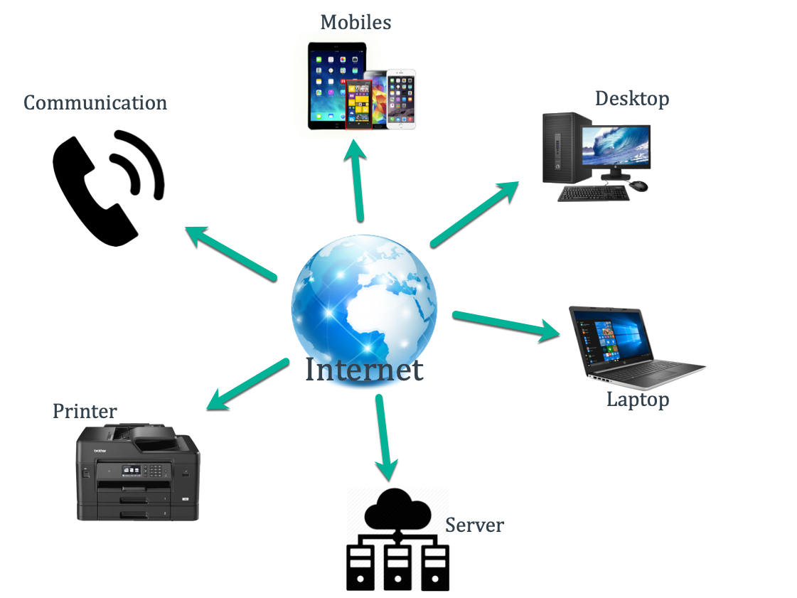
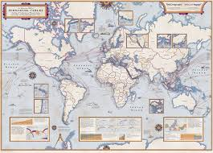

# Web Mechanism: How the Internet Works 🌐💻

Welcome to **Web Mechanism** - your beginner-friendly guide to understanding how the Internet works! This repository explains the fascinating world of global communication networks in simple terms.


*Placeholder: Global Internet network visualization*

---


## Table of Contents

1. [What is the Internet?](#what-is-the-internet)
2. [History of the Internet](#history-of-the-internet)
3. [Cold War Influence](#cold-war-influence)
4. [How the Internet Works](#how-the-internet-works)
5. [Submarine Cables](#submarine-cables)
6. [Internet Protocols](#internet-protocols)
7. [Helpful Videos](#helpful-videos)
8. [References](#references)

---

## What is the Internet? 🤔

The **Internet** is a massive global network that connects billions of computers, smartphones, and other devices worldwide. Think of it as a giant digital highway system that allows information to travel from one device to another, anywhere in the world, in just seconds.

**Key Points:**
- **Global Network:** Connects devices across all continents
- **Information Sharing:** Allows instant communication and data exchange
- **Always Growing:** New devices and connections are added constantly
- **Decentralized:** No single organization controls the entire Internet


*Placeholder: Simple diagram showing connected devices around the world*

---

## History of the Internet 📚

### Timeline of Internet Development

#### **1957 - The Beginning**
- **Sputnik Launch:** USSR launches first satellite, sparking the Space Race
- USA realizes the need for better communication networks

#### **1962-1969 - ARPANET Era**
- **1962:** ARPANET concept developed by DARPA (US Defense Department)
- **1969:** First ARPANET connection between UCLA and Stanford
- **Purpose:** Create a communication network that could survive nuclear attacks

#### **1971-1980s - Foundation Technologies**
- **1971:** First email sent by Ray Tomlinson
- **1973:** TCP/IP protocol developed
- **1983:** ARPANET officially adopts TCP/IP (Internet's birthday!)

#### **1989-1990s - World Wide Web**
- **1989:** Tim Berners-Lee invents the World Wide Web at CERN
- **1991:** First website goes online
- **1993:** Mosaic browser makes the web user-friendly
- **1995:** Internet becomes commercial (no longer just for academics/military)

#### **2000s-Present - Modern Internet**
- **2000s:** Broadband internet becomes common
- **2004:** Social media revolution begins (Facebook, YouTube)
- **2010s:** Mobile internet and smartphones dominate
- **2020s:** Cloud computing, IoT, and AI integration


*Placeholder: Visual timeline showing key Internet milestones*

---

## Cold War Influence ❄️⚔️

The Internet's creation was heavily influenced by the **Cold War** tension between the USA and USSR (1947-1991).

### The Sputnik Effect


*Placeholder: Image of Sputnik 1 satellite*

- **October 4, 1957:** USSR launches Sputnik 1, the first artificial satellite
- **American Response:** Fear that USSR had superior technology
- **Result:** USA invests heavily in science, technology, and defense research

### USA vs USSR Technology Race


*Placeholder: Image showing USA and USSR flags with technology symbols*

**Key Motivations for Internet Development:**
- **Survival:** Need for communication systems that could survive nuclear attacks
- **Decentralization:** No single point of failure
- **Military Advantage:** Better coordination of defense systems
- **Scientific Collaboration:** Connect research institutions across the country

**Fun Fact:** The Internet was designed to route around damage - if one connection was destroyed, data could find another path!

---

## How the Internet Works ⚙️

### 4.1. Basic Components

The Internet consists of four main components working together:

#### **Clients** 📱💻
- **What they are:** Your devices (computers, phones, tablets)
- **What they do:** Request and display information
- **Examples:** Your laptop browsing YouTube, your phone checking email

#### **Servers** 🏢
- **What they are:** Powerful computers that store and serve data
- **What they do:** Store websites, videos, files, and send them to clients
- **Examples:** Google's servers, Netflix servers, your email provider's servers

#### **Routers** 🛣️
- **What they are:** Smart traffic directors for internet data
- **What they do:** Decide the best path for your data to travel
- **Examples:** Your home WiFi router, ISP routers, backbone routers

#### **ISPs (Internet Service Providers)** 🌐
- **What they are:** Companies that provide internet access
- **What they do:** Connect your home/business to the global Internet
- **Examples:** Comcast, Verizon, AT&T, local cable companies


*Placeholder: Diagram showing clients, servers, routers, and ISPs*

### 4.2. Data Transmission in Packets 📦

When you send data over the Internet, it doesn't travel as one big chunk. Instead:

1. **Breaking Down:** Your data is split into small pieces called **packets**
2. **Labeling:** Each packet gets an address label (like a postal address)
3. **Multiple Paths:** Packets can take different routes to reach the destination
4. **Reassembly:** All packets are put back together at the destination

**Why Packets?**
- **Efficiency:** Multiple users can share the same connection
- **Reliability:** If one packet is lost, only that small piece needs to be resent
- **Speed:** Packets can take the fastest available route

```
Original Message: "Hello World!"
Packet 1: "Hel" + Address Info
Packet 2: "lo " + Address Info  
Packet 3: "Wor" + Address Info
Packet 4: "ld!" + Address Info
```


*Placeholder: Animation showing data being split into packets and traveling different routes*

### 4.3. IP Addresses & DNS 🏠

#### **IP Addresses: Internet Phone Numbers**

Every device on the Internet has a unique **IP Address** (Internet Protocol Address).

- **IPv4 Example:** `192.168.1.1`
- **IPv6 Example:** `2001:0db8:85a3:0000:0000:8a2e:0370:7334`
- **Purpose:** Like a postal address, tells data where to go

#### **DNS: The Internet's Phone Book**

**Domain Name System (DNS)** translates human-friendly names into IP addresses.

**How it works:**
1. You type `www.google.com` in your browser
2. DNS looks up the IP address for Google's servers
3. Your browser connects to that IP address
4. Google's website loads

```
Human-Friendly: www.google.com
Computer Address: 142.250.191.14
```


*Placeholder: Diagram showing DNS translation process*

---

## Submarine Cables 🌊🔌

### The Ocean's Internet Highway

**Submarine cables** are thick cables laid on the ocean floor that carry most of the world's internet traffic between continents.

### Key Facts:
- **99% of international data** travels through submarine cables
- **Fiber optic technology** enables lightning-fast data transmission
- **Hundreds of cables** connect continents worldwide
- **Vulnerable to:** Ship anchors, earthquakes, shark bites (seriously!)


*Placeholder: Cross-section image of a submarine internet cable*

### Global Cable Network


*Placeholder: World map showing submarine cable routes connecting continents*

### Cable Facts:
- **Atlantic:** Multiple cables connect North America and Europe
- **Pacific:** Cables connect Asia, Australia, and the Americas  
- **Redundancy:** Multiple cables ensure if one breaks, others maintain connection
- **Speed:** Modern cables can carry terabits of data per second

---

## Internet Protocols 📋

**Protocols** are rules that govern how devices communicate on the Internet. Think of them as different languages for different purposes.

### Popular Protocols:

#### **HTTP (HyperText Transfer Protocol)**
- **Purpose:** Loading websites
- **Example:** `http://example.com`
- **Security:** Not encrypted (can be intercepted)

#### **HTTPS (HTTP Secure)**  
- **Purpose:** Secure website loading
- **Example:** `https://google.com`
- **Security:** Encrypted (safe for passwords, payments)
- **Look for:** Lock icon 🔒 in your browser

#### **FTP (File Transfer Protocol)**
- **Purpose:** Uploading/downloading files
- **Example:** Website developers uploading files to servers
- **Usage:** Less common now, mostly replaced by secure alternatives

#### **SMTP (Simple Mail Transfer Protocol)**
- **Purpose:** Sending emails
- **Behind the scenes:** Your email app uses SMTP to send messages

#### **POP3/IMAP**
- **Purpose:** Receiving emails
- **Difference:** POP3 downloads emails, IMAP syncs across devices

```
Protocol Examples:
https://www.github.com     ← HTTPS for secure browsing
ftp://files.example.com    ← FTP for file transfer  
smtp://mail.gmail.com      ← SMTP for sending email
```


*Placeholder: Diagram showing different protocols and their uses*

---

## Helpful Videos 📺

Here are some excellent beginner-friendly videos to deepen your understanding:

### **Basic Internet Concepts**
[](https://www.youtube.com/watch?v=7_LPdttKXPc)
**"How Does the Internet Work?"** by Code.org (6 minutes)

[](https://www.youtube.com/watch?v=kBXQZMmiA4s)
**"How the Internet Works in 5 Minutes"** by Aaron Titus (5 minutes)

### **Technical Deep Dives**
[](https://www.youtube.com/watch?v=AEaKrq3SpW8)
**"How Does the Internet Work? - Glad You Asked"** by Vox (12 minutes)

[](https://www.youtube.com/watch?v=IlAJJI-qG2k)
**"How the Internet Travels Across Oceans"** by Wendover Productions (10 minutes)

### **History & Context**
[](https://www.youtube.com/watch?v=21eFwbb48sE)
**"The History of the Internet"** by Crash Course (12 minutes)

---

## References 📖

### Books
- Hafner, K., & Lyon, M. (1996). *Where Wizards Stay Up Late: The Origins of the Internet*. Simon & Schuster.
- Blum, A. (2012). *Tubes: A Journey to the Center of the Internet*. Ecco.

### Academic Papers
- Cerf, V., & Kahn, R. (1974). "A Protocol for Packet Network Intercommunication." IEEE Transactions on Communications.
- Berners-Lee, T., Hendler, J., & Lassila, O. (2001). "The Semantic Web." Scientific American.

### Online Resources
- [Internet Society - Brief History of the Internet](https://www.internetsociety.org/internet/history-internet/brief-history-internet/)
- [How Stuff Works - How Internet Works](https://computer.howstuffworks.com/internet/basics/internet.htm)
- [Mozilla Developer Network - How the Web Works](https://developer.mozilla.org/en-US/docs/Learn/Getting_started_with_the_web/How_the_Web_works)

### Organizations
- **ICANN** (Internet Corporation for Assigned Names and Numbers)
- **IEEE** (Institute of Electrical and Electronics Engineers)  
- **W3C** (World Wide Web Consortium)
- **Internet Society** (ISOC)

---

## Contributing 🤝

Want to improve this guide? We welcome contributions!

1. Fork this repository
2. Create a feature branch (`git checkout -b feature/improvement`)
3. Make your changes
4. Submit a pull request

### Areas for Contribution:
- Add more diagrams and illustrations
- Improve explanations for complex concepts
- Add examples and real-world applications
- Fix typos and grammar issues
- Suggest additional resources

---

## License 📄

This project is licensed under the MIT License - see the [LICENSE](LICENSE) file for details.

---

**Made with ❤️ for curious minds learning about the Internet**

*Last updated: [Current Date]*